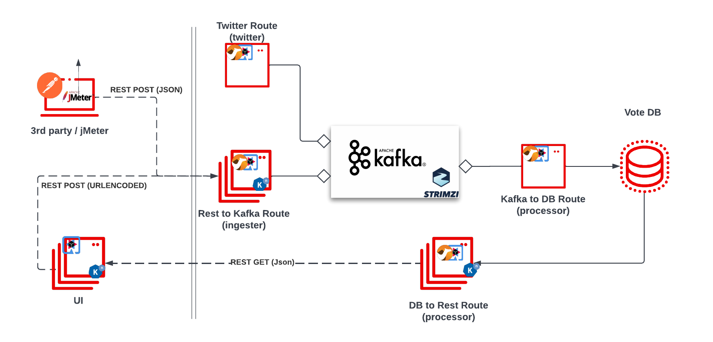

Votes Processor
========================

This demo project illustrates how Camel Quarkus applications can leverage Quarkus native builds and interact seamlessly with Apache Kafka and Knative Serving

Watch the demo in action during my talk at Devoxx: https://youtu.be/FBWgbhp8FG8

Application Architecture
------------------------

The application is composed of 4 applications that communicate through Rest and Kafka and consume a database



The UI application features a, well, UI, that shows the results of a poll and a form to vote for your favorite Java stack.
When you vote, a REST POST event gets sent to the 'ingester' app, which will translate the result and add it to a Kafka topic.  This app is designed to scale out rapidly with Knative so that it can handle bursts of requests.  
The 3rd application (processor) consumes the Kafka messages at its own pace and updates the database accordingly. (eg. if someone voted 'quarkus', the counter for quarkus would be incremented by 1)
The 'retriever' application (currently embedded in the processor app) has a REST GET endpoint to get the results from the DB.  

Running the Application locally in Dev Mode
-------------------------------------------

You can run the entire application on your local machine in Quarkus dev mode.  As long as you have Docker/Podman running on your machine, Quarkus will take care of spinning up Dev Services (basically a containerized mock) for your database and Kafka, so all you need to worry about is running the applications.  Nice huh? :)

Either start each process in a separate terminal as shown below; or if you want to just start the entire thing in one go, you can run `./devmode.sh`

```bash
mvn -f ui quarkus:dev
```

and in another terminal:

```bash
mvn -f ingester quarkus:dev
```

and in yet another terminal:

```bash
mvn -f processor quarkus:dev
```

Then, open your browser at `http://localhost:8080`.
You can send requests and observe the votes table changing (asynchronously).

Anatomy
--------

The application is composed of the following components:

### UI
The _ui_ application displays a list of java stacks/frameworks that you can vote for by clicking the respective button next to it.  This action calls the _ingester_ app.  The page also displays a bar chart of the results so far.  The app is built with Quarkus Qute templating and some crappy javascript/jquery code :P

### Ingester

The _ingester_ Camel Quarkus application receives requests from the user (via HTTP) and forwards the requests to the Kafka broker.
The main component of the application:

* `RestToCamelRoute` : Camel route that receives a rest call and forwards it on to a Kafka broker

### Processor

The _processor_ Camel Quarkus application receives the vote requests from Kafka, processes them, and writes results into the `votesdb` Postgres DB table.  As of right now it also returns the results through a /getresults endpoint.
The application has the following Camel Routes:

* `processor/VotesRoute` consumes messages from a kafka topic (in json format), extracts the value of 'shortname' and increments the counter of the java stack that matches with this shortname.
* `RestRoute` returns data from the votes table in json format

Running in native
-----------------

You can compile the respective applications into a native binary using:

```bash
mvn package -Dnative
```

As you are running in _prod_ mode, you need a Kafka cluster.

Running On Openshift
-----------------------

1. Create a new openshift project 'cameldemo' (if you use a different name, make sure to update the respective application.properties files)
1. Install the Openshift Serverless (Knative) Operator
1. Install Openshift Serverless "Knative Serving" component
1. Install AMQ Streams (Kafka) Operator
1. Using the kubefiles/config/configmap-example.yaml and kubefiles/config/secrets-example.yaml as an example, create a secrets.yaml and configmap.yaml and apply the yamls (eg. kubectl apply -f kubefiles/config/secrets.yaml -f kubefiles/config/configmap.yaml)
1. In the AMQ Streams operator, install the kafka cluster component.  Make sure the cluster name matches up with the cluster service name in the kubefiles/config/configmap.yaml file.
1. Install a Postgresql Database (you can use the built in Openshift template).  Name the db 'votedb' and set the username and password to what you have configured in the kubefiles/config/secrets.yaml.
1. Build and deploy the applications.  If you're logged in to Openshift in your terminal, you can run `mvn clean package -Dnative -Dquarkus.kubernetes.deploy` and Quarkus will take care of building native binaries and deploying them to Openshift and it will even configure the wiring to use the secrets and configmaps for you. 
Alternatively you can also let Quarkus build & push native container images using the Quarkus CLI: `quarkus push --also-build --native --registry=quay.io`.  And then use the kubefiles/argo/* yamls to deploy the applications (eg. using ArgoCD)

you can also build the image and deploy with knative, eg. kn service create cameldemo-processor --env-from cm:appconfig --env-from secret:db --image=quay.io/kevindubois/cameldemo-processor --force

Bonus Feature
-------------

There is also a twitter module that searches for matching keywords in tweets addressed to me (@kevindubois) and adds them to the kafka votes topic as well.  The same process applies as for the above modules to deploy.  Either run locally with `mvn quarkus:dev` or deploy to kubernetes with eg. `mvn clean package -Pnative -Dquarkus.kubernetes.deploy`.  Make sure to update your application.properties and/or kubefiles/secrets.yaml with your twitter credentials.  
