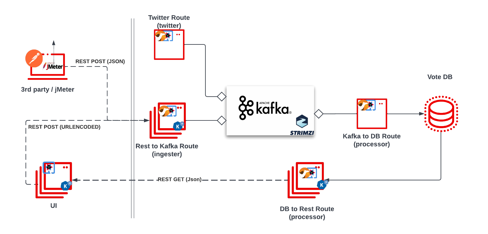

# Votes Processor

This demo project illustrates how Camel Quarkus applications can leverage Quarkus native builds and interact seamlessly with Apache Kafka and Knative Serving

Watch the demo in action during my talk at Devoxx: <https://youtu.be/FBWgbhp8FG8>

## Application Architecture

The application is composed of 4 applications that communicate through Rest and Kafka and consume a database



The UI application features a, well, UI, that shows the results of a poll and a form to vote for your favorite Java stack.
When you vote, a REST POST event gets sent to the 'ingester' app, which will translate the result and add it to a Kafka topic.  This app is designed to scale out rapidly with Knative so that it can handle bursts of requests.  
The 3rd application (processor) consumes the Kafka messages at its own pace and updates the database accordingly. (eg. if someone voted 'quarkus', the counter for quarkus would be incremented by 1)
The 'retriever' application (currently embedded in the processor app) has a REST GET endpoint to get the results from the DB.  

## Running the Application locally in Dev Mode

You can run the entire application on your local machine in Quarkus dev mode.  As long as you have Docker/Podman running on your machine, Quarkus will take care of spinning up Dev Services (basically a containerized mock) for your database and Kafka, so all you need to worry about is running the applications.  Nice huh? :)

Either start each process in a separate terminal as shown below; or if you want to just start the entire thing in one go, you can run `./devmode.sh`

```bash
mvn -f ui quarkus:dev
```

and in another terminal:

```bash
mvn -f ingester quarkus:dev
```

and in yet another terminal:

```bash
mvn -f processor quarkus:dev
```

Then, open your browser at `http://localhost:8080`.
You can send requests and observe the votes table changing (asynchronously).

## Anatomy

The application is composed of the following components:

### UI

The _ui_ application displays a list of java stacks/frameworks that you can vote for by clicking the respective button next to it.  This action calls the _ingester_ app.  The page also displays a bar chart of the results so far.  The app is built with Quarkus Qute templating and some crappy javascript/jquery code :P

### Ingester

The _ingester_ Camel Quarkus application receives requests from the user (via HTTP) and forwards the requests to the Kafka broker.
The main component of the application:

* `RestToCamelRoute` : Camel route that receives a rest call and forwards it on to a Kafka broker

### Processor

The _processor_ Camel Quarkus application receives the vote requests from Kafka, processes them, and writes results into the `votesdb` Postgres DB table.  As of right now it also returns the results through a /getresults endpoint.
The application has the following Camel Routes:

* `processor/VotesRoute` consumes messages from a kafka topic (in json format), extracts the value of 'shortname' and increments the counter of the java stack that matches with this shortname.
* `RestRoute` returns data from the votes table in json format

## Compiling to native binary

You can compile the respective applications into a native binary using:

```bash
mvn package -Dnative
```

## Deploy to OpenShift

### One-Command Deployment with Kustomize

The easiest way to deploy the entire application stack (operators, PostgreSQL, Kafka, and all app components) is using kustomize:

```bash
kubectl apply -k kubefiles/
```

This will deploy:
- OpenShift Serverless operator
- Red Hat Streams for Apache Kafka (Strimzi) operator
- Knative Serving instance
- Kafka cluster (my-cluster)
- PostgreSQL database with credentials
- ConfigMap with Kafka bootstrap servers and internal service URLs
- Application services: ingester, processor, and UI

**Note:** The operators may take a few minutes to install. If the Kafka cluster or Knative services fail initially, wait for the operators to be ready and re-run the command.

**Local development note:** If you want custom configuration for local deployment, you can copy the example files:
```bash
cp kubefiles/configs/configmap-example.yaml kubefiles/configs/configmap.yaml
# Edit configmap.yaml with your custom values
# These files are gitignored to avoid committing cluster-specific configs
```

### Alternative: Deploy with ArgoCD

If you have ArgoCD (OpenShift GitOps) installed on your cluster:

```bash
kubectl apply -f kubefiles/argo/argo-application.yaml
```

This creates an ArgoCD Application that:
- Monitors this GitHub repository's `kubefiles/` directory
- Automatically deploys all components
- Syncs changes from the main branch
- Auto-creates the `cameldemo` namespace

ArgoCD will deploy resources in the correct order using sync waves:
- **Wave 0**: Operators (Serverless, Strimzi)
- **Wave 1**: Knative Serving (after operators are ready)
- **Wave 2**: Kafka cluster (after Strimzi is ready)
- **Wave 3**: PostgreSQL and ConfigMap
- **Wave 4**: Application services (after all infrastructure is ready)

### After Deployment

1. Wait for all pods to be ready: `kubectl get pods -n cameldemo`
2. Get the UI route: `kubectl get ksvc cameldemo-ui -n cameldemo`
3. Access the application through the provided URL

### Manual Deployment (Alternative)

If you prefer to deploy components individually:

1. Create the namespace: `kubectl create namespace cameldemo`
2. Install operators:
   ```bash
   kubectl apply -f kubefiles/serverless-subscription.yaml
   kubectl apply -f kubefiles/strimzi-subscription.yaml
   ```
3. Wait for operators to be ready, then deploy infrastructure:
   ```bash
   kubectl apply -f kubefiles/knative-serving.yaml
   kubectl apply -f kubefiles/kafka-strimzi.yaml
   kubectl apply -f kubefiles/postgresql.yaml -n cameldemo
   ```
4. Deploy configuration and applications:
   ```bash
   kubectl apply -f kubefiles/configs/configmap.yaml -n cameldemo
   kubectl apply -f kubefiles/ingester.knative.yaml -n cameldemo
   kubectl apply -f kubefiles/processor.knative.yaml -n cameldemo
   kubectl apply -f kubefiles/ui.knative.yaml -n cameldemo
   ```

### Developer Sandbox Note

If using the free OpenShift Developer Sandbox (https://developers.openshift.com/sandbox):
- Serverless is pre-installed
- You won't have access to the Kafka operator
- Use the lightweight Kafka instead: `kubectl apply -f kubefiles/kafka-no-keeper.yaml -n cameldemo`

## Option 2: Build the application locally and deploy with Quarkus

1. Build and deploy the applications.  If you're logged in to Openshift in your terminal, you can run:

```bash
quarkus build -Dquarkus.openshift.deploy
```

and Quarkus will take care of building the application and deploying it to Openshift and it will even configure the wiring to use the secrets and configmaps for you.
If you want to deploy a native binary, you can add the -Dnative flag to build a native binary
(If you're not on Linux, you will also likely need to add ` --no-tests -Dquarkus.native.container-build=true`)

## Option 3: (Linux Only) Compile to native binaries, build container images and push to registry, then deploy to Openshift/Kubernetes

You can also let Quarkus build & push native container images using the Quarkus CLI (Make sure to update the --group value with your Quay user!).

```bash
quarkus image push --also-build --native --registry=quay.io --group=yourquayuser
```

Then apply the yaml files (make sure to update the images in your yamls from `kevindubois` to YOUR quay user!)

```bash
    kubectl apply -f kubefiles/processor.knative.yaml -f kubefiles/ingester.knative.yaml -f kubefiles/ui.knative.yaml -n cameldemo
```

## Option 4: Deploy images with kn service:

```bash
kn service create cameldemo-processor --env-from cm:appconfig --env-from secret:postgresql --image=quay.io/kevindubois/cameldemo-processor --force
kn service create cameldemo-ingester --env-from cm:appconfig --env-from secret:postgresql --image=quay.io/kevindubois/cameldemo-ingester --force
kn service create cameldemo-ui --env-from cm:appconfig --env-from secret:postgresql --image=quay.io/kevindubois/cameldemo-ui --force
```

